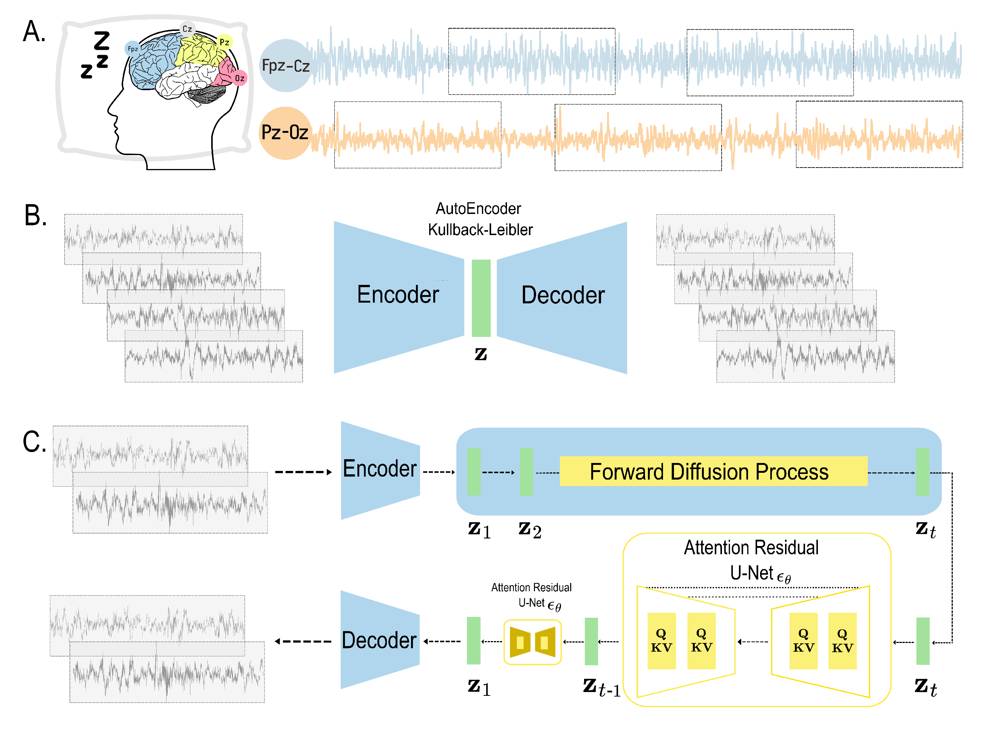

<h1 align="center">
  <br> [DGM4H Workshop@Neurips 2023] Synthetic Sleep EEG Signal Generation using Latent Diffusion-Models  <br>
</h1>




## This repository is the official implementation of the article presented at the event. [[Paper]](https://github.com/bruAristimunha/estamira-coerencia-discursos/blob/master/reports/ERAMIA_SP_2020.pdf) [[Citation]](#Ccitation) 

> **Abstract:** Electroencephalography (EEG) is a non-invasive method that allows for recording rich temporal information and is a valuable tool for diagnosing various neurological and psychiatric conditions. One of the main limitations of EEG is the low signal-to-noise ratio and the lack of data availability to train large data-hungry neural networks. Sharing large healthcare datasets is crucial to advancing medical imaging research, but privacy concerns often impede such efforts. Deep generative models have gained attention as a way to circumvent data-sharing limitations and as a possible way to generate data to improve the performance of these models. This work investigates latent diffusion models with spectral loss as deep generative modeling to generate 30-second windows of synthetic EEG signals of sleep stages. The spectral loss is essential to guarantee that the generated signal contains structured oscillations on specific frequency bands that are typical of EEG signals. We trained our models using two large sleep datasets (\emph{Sleep EDFx} and \emph{SHHS}) and used the Multi-Scale Structural Similarity Metric, Frechet inception distance, and a spectrogram analysis to evaluate the quality of synthetic signals. We demonstrate that the latent diffusion model can generate realistic signals with the correct neural oscillation and could, therefore, be used to overcome the scarcity of EEG data.>**** 
> 
## Disclaimer

This repository contains a workshop paper, a reflex of the work in progress. 
**This repository doesn't propose to be a package or a library**, but a collection of scripts and notebooks to reproduce the results.
The author understands that the code could be in better shape but is a work in progress. The author is open to any suggestions, and the code will be improved in the future.

As discussed in the paper, the spectral loss is unstable, so depending on the dataset, the loss can explode. We used the last model before the loss exploded to compact the representation of the samples.

## How to reproduce the results


1. Clone this repository

```shell
git clone https://github.com/bruAristimunha/Synthetic-Sleep-EEG-Signal-Generation-using-Latent-Diffusion-Models
```

2. Install Docker following docker installation guide for your OS. (optional)

3. Run the following command to build the docker image (optional)
```shell
bash cluster/create_runai.sh
```
----

4. Training

```
python src/train_autoencoderkl.py
python src/train_ldm.py 
```

5. Generate the samples

You can generate the samples using the script for this.

6. Evaluation

You can evaluate the metrics using the testing script for this.

# License
This work is present as [BSD 3-Clause License](LICENSE), so you can't use it for commercial purposes.

## Citation

In latex format:

```bibtex
@inproceedings{
aristimunha2023synthetic,
title={{Synthetic Sleep {EEG} Signal Generation using Latent Diffusion Models}},
author={Bruno Aristimunha and Raphael Yokoingawa de Camargo and Sylvain Chevallier and Oeslle Lucena and Adam Thomas and M. Jorge Cardoso and Walter Lopez Pinaya and Jessica Dafflon},
booktitle={Deep Generative Models for Health Workshop NeurIPS 2023},
year={2023},
}
```

In plain text:

Aristimunha, B., de Camargo, R.Y., Chevallier, S., Thomas, A.G., Lucena, O., Cardoso, J., Pinaya, W.H.L. and Dafflon, J., 2023, December. Synthetic Sleep EEG Signal Generation using Latent Diffusion Models. In NeurIPS 2023 Workshop DGM4H.


